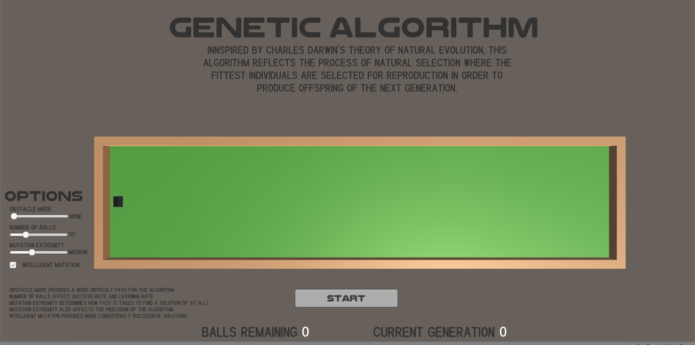

# Genetic Algorithm
https://simmer.io/@Kyloman/genetic-algorithm
This project utilizes the genetic algorithm in order to simulate natural selection. 

The algorithm itself can be modified using the sliders in order to better show how the algorithm works. For example, a higher mutation will provide faster but less consistent results. As the program runs, the AI will start to learn where the hole is through favoring the balls which arrive closer to the hole for reproduction until eventually all the balls will take the same course and attempt to arrive at the hole.
